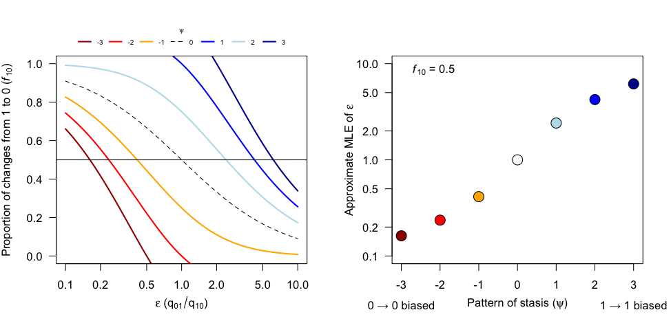
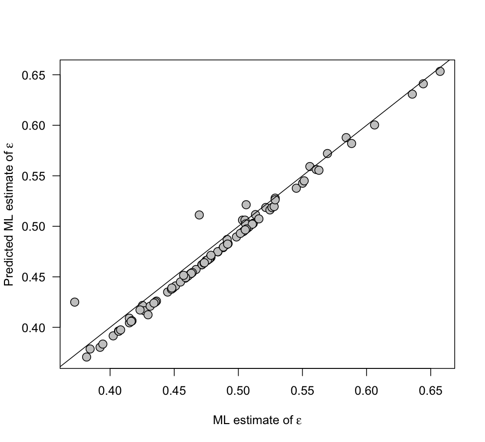



## The role of stasis in determining transition rate asymmetry

Abstract
--------
Transition rates estimated for macroevolutionary models of discrete character evolution are commonly interpreted as providing a historical
description of the pattern of change from ancestor to descendant. In other words, if we estimate a higher transition rate from state A to
state B than the reverse this must be because more change from an ancestral state of A to a derived state of B is needed to explain the data.
However, because the likelihood calculations in these models are also affected by patterns of apparent stasis, it is unclear when asymmetries
in transition rates match the pattern of asymmetry in the historical sequence of state changes that actually occurred. To gain insight into
this problem I study the expected behavior of a simple two-state model of discrete character evolution. To a first order approximation, I
find that the ratio of transition rates equals the ratio of the number of character state changes (i.e., when the pattern of asymmetry in
rates matches the pattern of asymmetry in character change) only when the amount of time spent in stasis in each state is equal. When the
amount of time in stasis in each state is unequal, the ratio of transition rates is biased in the direction of the state displaying the most
stasis, sometimes to the point where it can overwhelm the pattern change. In other words, even if nearly all change is from A to B the
transition rate from B to A can be much higher than the reverse rate if most of the tree is in state B. Researchers who use asymmetric models
of discrete character evolution should be aware of this property and exercise caution when attempting to interpret asymmetries in transition
rates as reflective of a historical pattern of asymmetry in character state change. Especially in large phylogenies, significant asymmetries
in transition rates are most likely driven by asymmetries in character state stasis rather than asymmetries in character state change.

Results
-------
For a two-state continuous-time Markov chain of discrete character evolution the
lineage transition probabilities are,

$$
p_{01}(t) = \frac{\epsilon}{1 + \epsilon} - \frac{\epsilon}{1 + \epsilon}e^{-\tau t}
$$

$$
p_{00}(t) = \frac{1}{1 + \epsilon} + \frac{\epsilon}{1 + \epsilon}e^{-\tau t}
$$

$$
p_{10}(t) = \frac{1}{1 + \epsilon} - \frac{1}{1 + \epsilon}e^{-\tau t}
$$

$$
p_{11}(t) = \frac{\epsilon}{1 + \epsilon} - \frac{1}{1 + \epsilon}e^{-\tau t}
$$

where $$ \tau = q_{01} + q_{10}$$, $$ \epsilon = \frac{q_{01}}{q_{10}} $$, and
$$ q_{01} $$ and $$ q_{10} $$ are the forward and reverse transition rates.

My focus for this study concerns the behavior of the maximum likelihood estimator
for the parameter $$ \epsilon $$. I use the symbol $$ L_{\hat{X}} $$  to represent
the likelihood of $$ \hat{X} $$, which represents an assignment of character states to
all nodes in a phylogeny that is consistent with the observed state assignments at
the terminal nodes. In standard practice, the likelihood $$ L $$ of the observed
state assignments is computed by summing over all possible $$ \hat{X} $$  so that
$$ L = \sum_{\hat{X}}{L_{\hat{X}}} $$. Because $$ L_{\hat{X}} $$  is just a product
of independent lineage transition probabilities we have,

$$
\frac{\partial L}{\partial \epsilon} = \sum_{\hat{X}}{L_{\hat{X}} b(\hat{X})}
$$

$$
b(\hat{X}) = \sum_{e=(u, v)}{\frac{\frac{\partial}{\partial \epsilon}p_{\hat{X}(u)\hat{X}(v)}(t_e)}{p_{\hat{X}(u)\hat{X}(v)}(t_e)}}
$$

Where the second sum runs over each edge $$ e=(u,v) $$ connecting ancestral node
$$ u $$ with descendant node $$ v $$. We can gain insight into the behavior of the
likelihood function by studying $$ b(\hat{X}) $$, which can be written as,

$$
b(\hat{X}) = \sum_{e=(u, v):\\\hat{X}(u)=0\\\hat{X}(u)=1}{\frac{1}{(1 + \epsilon)\epsilon}} - \sum_{e=(u, v):\\\hat{X}(u)=1\\\hat{X}(u)=0}{\frac{1}{1 + \epsilon}} + \sum_{e=(u, v):\\\hat{X}(u)=1\\\hat{X}(u)=1}{\frac{1 - e^{-\tau t_e}}{(1 + \epsilon)(\epsilon + e^{-\tau t_e})}} - \sum_{e=(u, v):\\\hat{X}(u)=0\\\hat{X}(u)=0}{\frac{1 - e^{-\tau t_e}}{(1 + \epsilon)(1 + \epsilon e^{-\tau t_e})}}
$$

To a first order approximation, which will be reasonably accurate whenever the
rate of character evolution $$ \tau $$ is low, this can be represented as,

$$
b(\hat{X}) = \sum_{e=(u, v):\\\hat{X}(u)=0\\\hat{X}(u)=1}{\frac{1}{(1 + \epsilon)\epsilon}} - \sum_{e=(u, v):\\\hat{X}(u)=1\\\hat{X}(u)=0}{\frac{1}{1 + \epsilon}} + \sum_{e=(u, v):\\\hat{X}(u)=1\\\hat{X}(u)=1}{\frac{\tau t_e}{(1 + \epsilon)^2}} - \sum_{e=(u, v):\\\hat{X}(u)=0\\\hat{X}(u)=0}{\frac{\tau t_e}{(1 + \epsilon)^2}}
$$

Recalling that $$ \epsilon = \frac{q_{01}}{q_{10}} $$, the above tells us that the
ML estimate of $$ \epsilon $$ is an increasing function of the number of changes
from ancestral state 0 to descendant state 1 and the amount time where ancestor and
descendant are both in state 1 (stasis). Conversely, the ML estimate of $$ \epsilon $$
is a decreasing function of the number of changes from ancestral state 1 to descendant
state 0 and the amount of time where ancestor and descendant are both in state 0.
The ML estimate of $$ \epsilon $$ for the average likelihood $$ L $$
(i.e., the likelihood that results from summing the individual character history likelihoods)
is influenced by each character history $$ \hat X $$. Each configuration $$ \hat X $$
will tend to pull the estimate of $$ \epsilon $$ towards its own ML estimate, and
it will do so with a force equal to $$ L_{\hat X}  b(\hat X) $$. In other words,
high likelihood configurations influence the ML estimate more than low likelihood
configurations. The ML estimate of $$ \epsilon $$ for each individual history is
just the value of $$ \epsilon $$ that solves $$ b(\hat X)=0 $$. The behavior of
these individual configuration ML estimates can be studied graphically as follows.
Let $$ f_{10} = \frac{n_{10}}{n_{01} + n_{10}} $$ be the fraction of all state
changes from ancestor to descendant that represent reversals to state 0, and let
$$ \psi = \frac{1}{n_{01} + n_{10}}(\sum_{e=(u, v):\\\hat{X}(u)=1\\\hat{X}(u)=1}{\tau t_e} - \sum_{e=(u, v):\\\hat{X}(u)=0\\\hat{X}(u)=0}{\tau t_e}) $$,
which represents the between state difference in lineage length displaying stasis
scaled by the number of net changes from ancestor to descendant. Positive values
correspond to an excess of stasis in state 1 and negative values correspond to an
excess of stasis in state 0. Solutions to $$ b(\hat X) = 0 $$ can then be
expressed as,

$$
f_{10} = \frac{1}{1 + \epsilon} + \frac{\epsilon}{(1 + \epsilon)^2} \psi
$$

Approximate ML estimates of $$ \epsilon $$ occur where the horizontal line $$ f_{10} $$
intersects the curve $$ \frac{1}{1 + \epsilon} + \frac{\epsilon}{(1 + \epsilon)^2} \psi $$.
Examples of these solution curves are shown in Figure 1.



The overall picture that
emerges is that the pattern of stasis can dramatically impact the ML estimate of
the ratio of transition rates. For example, even if 100 percent of state changes
between ancestor and descendant represent gains of state 1, the transition rate
from state 1 to state 0 can be higher, sometimes much higher, than the transition
rate from state 0 to state 1 if the majority of tree length is in state 0.

Supplementary Material
----------------------
Here I verify that the approximation is reliable using the squamate reproductive
mode dataset from Pyron & Burbrink (2014). To do so I sampled 100 maximum
parsimony histories of character evolution and numerically estimated the ML value
of $$ \epsilon $$ and $$ \tau $$ using the R function ```optim```. I then
calculated the predicted ML estimate of $$ \epsilon $$ using the approximation
method discussed above while holding $$ \tau $$ fixed to the ML estimate obtained
with ```optim```. The correspondence between the predicted and actual ML estimates
of $$ \epsilon $$ is quite good:



